# Mr. Coder Backend Architecture Flowchart
## Node.js + MongoDB Backend System

### 🏗️ System Architecture Overview

```
┌─────────────────┐    ┌─────────────────┐    ┌─────────────────┐
│   Frontend      │    │   Backend       │    │   Database      │
│   (Next.js)     │◄──►│   (Node.js)     │◄──►│   (MongoDB)     │
└─────────────────┘    └─────────────────┘    └─────────────────┘
                              │
                              ▼
                       ┌─────────────────┐
                       │   External      │
                       │   Services      │
                       └─────────────────┘
```

### 📊 Main Application Flow

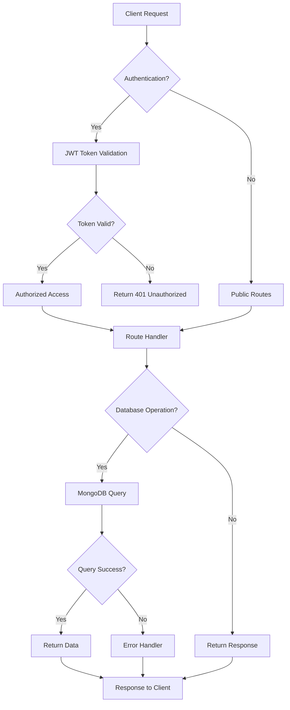

### 🔐 Authentication Flow

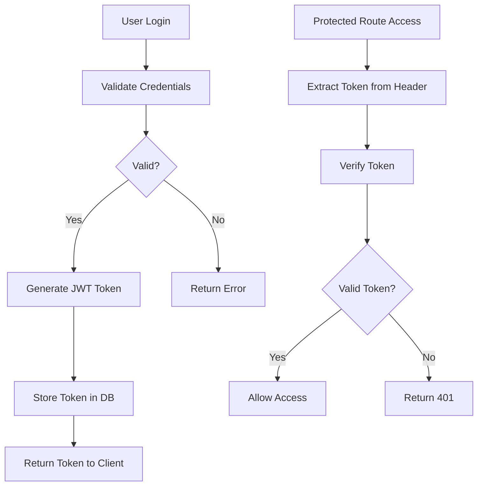

### 💾 Database Operations Flow

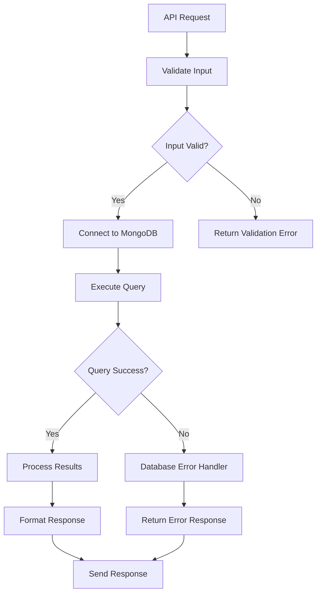

### 🎯 Core API Endpoints Flow

#### User Management
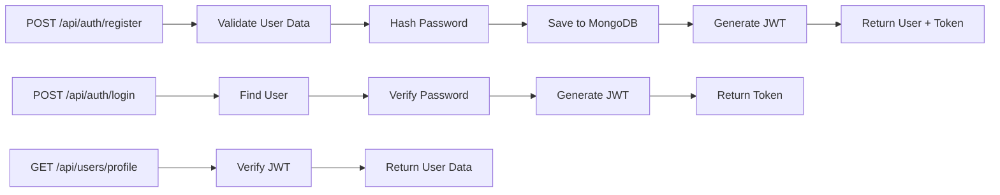

#### Project Management
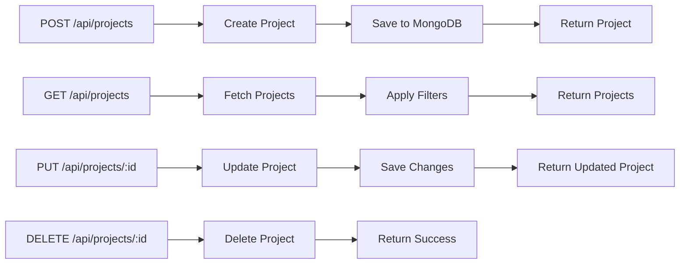

#### Meeting Management
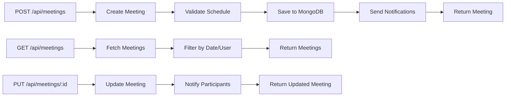

### 🔧 Database Schema Flow

#### User Collection
```javascript
{
  _id: ObjectId,
  email: String,
  password: String (hashed),
  name: String,
  role: String,
  avatar: String,
  createdAt: Date,
  updatedAt: Date
}
```

#### Project Collection
```javascript
{
  _id: ObjectId,
  title: String,
  description: String,
  status: String,
  clientId: ObjectId,
  teamMembers: [ObjectId],
  budget: Number,
  startDate: Date,
  endDate: Date,
  createdAt: Date,
  updatedAt: Date
}
```

#### Meeting Collection
```javascript
{
  _id: ObjectId,
  title: String,
  description: String,
  date: Date,
  time: String,
  duration: Number,
  participants: [ObjectId],
  createdBy: ObjectId,
  status: String,
  createdAt: Date,
  updatedAt: Date
}
```

### 🛡️ Security Flow

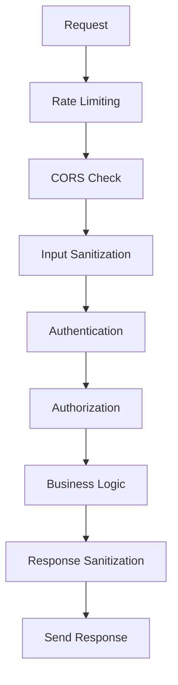

### 📈 Error Handling Flow

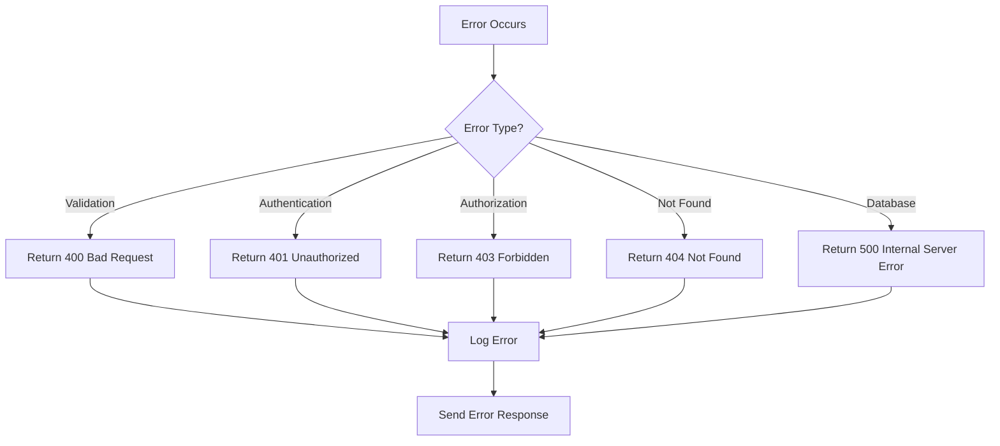

### 🚀 Implementation Steps

#### 1. Project Setup
```bash
# Initialize Node.js project
npm init -y

# Install dependencies
npm install express mongoose bcryptjs jsonwebtoken cors helmet morgan dotenv

# Install dev dependencies
npm install -D nodemon jest supertest
```

#### 2. Folder Structure
```
backend/
├── config/
│   ├── database.js
│   └── auth.js
├── controllers/
│   ├── authController.js
│   ├── userController.js
│   ├── projectController.js
│   └── meetingController.js
├── middleware/
│   ├── auth.js
│   ├── validation.js
│   └── errorHandler.js
├── models/
│   ├── User.js
│   ├── Project.js
│   └── Meeting.js
├── routes/
│   ├── auth.js
│   ├── users.js
│   ├── projects.js
│   └── meetings.js
├── utils/
│   ├── logger.js
│   └── helpers.js
├── app.js
└── server.js
```

#### 3. Environment Configuration
```env
# .env
NODE_ENV=development
PORT=5000
MONGODB_URI=mongodb://localhost:27017/mr_coder
JWT_SECRET=your_jwt_secret_key
JWT_EXPIRE=7d
```

#### 4. Database Connection Flow
```javascript
// config/database.js
const mongoose = require('mongoose');

const connectDB = async () => {
  try {
    const conn = await mongoose.connect(process.env.MONGODB_URI, {
      useNewUrlParser: true,
      useUnifiedTopology: true,
    });
    console.log(`MongoDB Connected: ${conn.connection.host}`);
  } catch (error) {
    console.error('Database connection error:', error);
    process.exit(1);
  }
};

module.exports = connectDB;
```

#### 5. Authentication Middleware Flow
```javascript
// middleware/auth.js
const jwt = require('jsonwebtoken');
const User = require('../models/User');

const protect = async (req, res, next) => {
  try {
    // 1. Get token from header
    const token = req.header('Authorization')?.replace('Bearer ', '');
    
    if (!token) {
      return res.status(401).json({ message: 'No token, authorization denied' });
    }
    
    // 2. Verify token
    const decoded = jwt.verify(token, process.env.JWT_SECRET);
    
    // 3. Get user from database
    const user = await User.findById(decoded.id).select('-password');
    
    if (!user) {
      return res.status(401).json({ message: 'Token is not valid' });
    }
    
    // 4. Add user to request
    req.user = user;
    next();
  } catch (error) {
    res.status(401).json({ message: 'Token is not valid' });
  }
};
```

### 🔄 API Response Flow

#### Success Response
```javascript
{
  success: true,
  data: {
    // Response data
  },
  message: "Operation successful"
}
```

#### Error Response
```javascript
{
  success: false,
  error: {
    code: "ERROR_CODE",
    message: "Error description"
  }
}
```

### 📊 Performance Optimization Flow

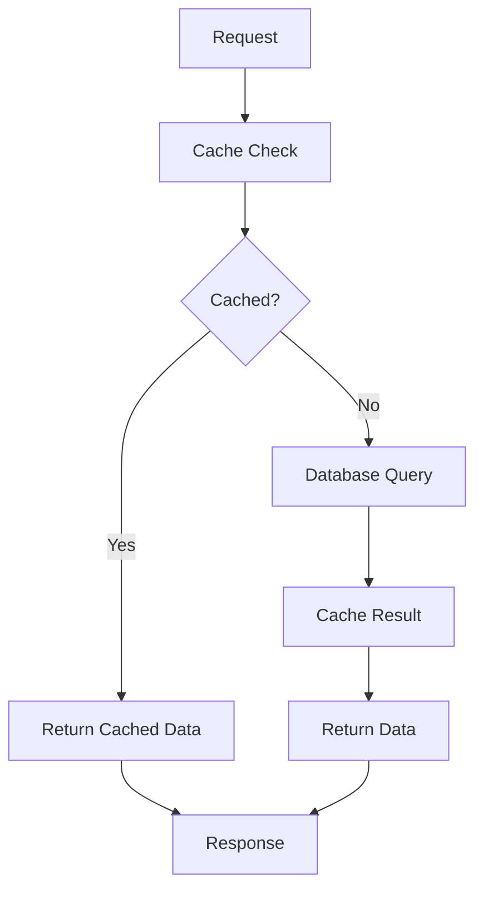

### 🔍 Monitoring & Logging Flow

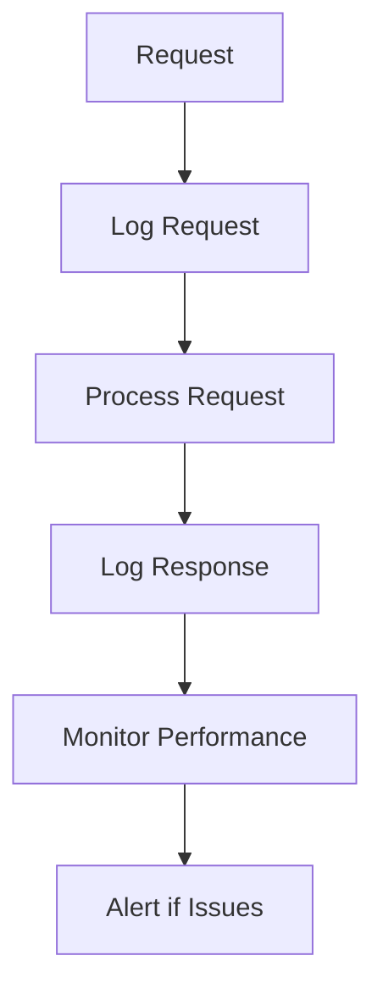

### 🚀 Deployment Flow

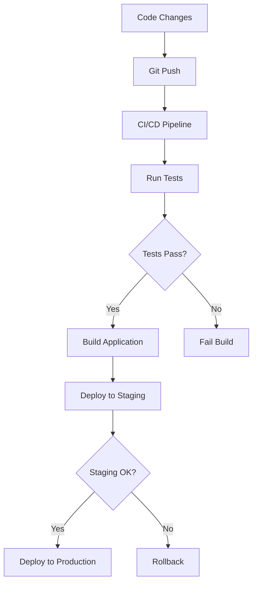

### 📋 API Documentation Flow

```javascript
// Example API endpoint documentation
/**
 * @route   POST /api/auth/login
 * @desc    Authenticate user and return token
 * @access  Public
 * @body    { email: string, password: string }
 * @returns { success: boolean, data: { user, token } }
 */
```

This comprehensive flowchart provides a complete backend architecture for Mr. Coder using Node.js and MongoDB, covering authentication, database operations, API endpoints, security, error handling, and deployment strategies. 